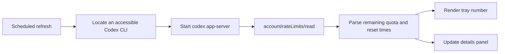

<div align="center">
  

  # MetrikLite

  **Keep your remaining Codex quota visible in the Windows tray.**

  A lightweight, native, local-first Windows tray utility that renders the remaining Codex percentage as a clear numeric icon and shows quota windows, reset times, and live status in a compact panel.

  [](#download-and-install)
  [](#requirements)
  [](#build-from-source)
  [](./LICENSE)

  [English](README.en.md) | [简体中文](README.md)

  <br>
  
</div>

## What is MetrikLite?

Codex quota information is easy to lose sight of while working. MetrikLite reduces it to a persistent tray number: glance at the taskbar for the tightest remaining window, then left-click for the full breakdown.

| Everyday friction | How MetrikLite handles it |
| --- | --- |
| Remaining Codex quota is hard to see | A numeric tray icon displays the remaining percentage |
| Short and weekly limits are easy to confuse | The panel separates both windows, progress bars, and reset times |
| Tray icons disappear after sleep | MetrikLite refreshes and re-registers icons after resume |
| Explorer restarts and clears the tray | The taskbar recreation message is handled automatically |
| Codex CLI paths differ between machines | Official winget, npm, PATH, and a manually selected path are supported |
| Target machines may not have .NET | Official releases are self-contained Windows x64 builds |

## Core capabilities

- Clear Segoe UI Variable numeric tray icons with automatic scaling and optical centering.
- Separate short-window and weekly-window cards with percentages and reset times on distinct lines.
- Apple-clean light panel positioned above the notification area, including high-DPI and multi-monitor handling.
- Automatic recovery after sleep, Explorer restart, and taskbar recreation.
- One reusable Codex app-server session across refreshes instead of repeated process-tree termination.
- Manual refresh, update checks, configurable startup, CLI selection, and local logs.
- Local Codex app-server communication with no MetrikLite cloud service.

## How it works



MetrikLite implements the public Codex app-server JSON-RPC flow using `initialize`, `initialized`, and `account/rateLimits/read`. It does not read chat contents or upload Codex credentials.

## Download and install

### Recommended: guided installer

[**Download MetrikLite 1.1.2 Setup**](https://github.com/mors-lee/MetrikLite/releases/download/v1.1.2/MetrikLite-Setup.exe)

The installer supports Simplified Chinese and English and guides you through:

1. Welcome information and the MIT license.
2. Per-user installation under `%LOCALAPPDATA%\Programs\MetrikLite`.
3. The optional sign-in startup task, enabled by default.
4. Closing a running older version during upgrades.
5. Start-menu and desktop shortcuts, followed by optional launch.

<div align="center">
  
</div>

No administrator privileges are required. The installer never asks for a GitHub password, verification code, or token.

### Portable downloads

- [Standalone EXE](https://github.com/mors-lee/MetrikLite/releases/download/v1.1.2/MetrikLite.exe)
- [Portable ZIP](https://github.com/mors-lee/MetrikLite/releases/download/v1.1.2/MetrikLite-portable-win-x64.zip)
- [All releases and release notes](https://github.com/mors-lee/MetrikLite/releases)

The installer is roughly 67 MB because it includes the complete .NET 8 Windows x64 runtime. Current builds are not Authenticode-signed and may trigger Microsoft Defender SmartScreen on first launch; download them only from this repository's Releases page.

## Requirements

- 64-bit Windows 10 or Windows 11.
- A separately installed and signed-in Codex CLI.
- Standard user permissions for installation and use.
- [.NET 8 SDK](https://dotnet.microsoft.com/download/dotnet/8.0) only when building from source.

Recommended CLI setup:

```powershell
winget install OpenAI.Codex
codex login
```

## First run

| Action | Result |
| --- | --- |
| Hover over the tray number | View a quota and reset-time summary |
| Left-click | Open the compact details panel |
| Right-click | Refresh, check for updates, select the CLI, manage startup, or exit |
| Click the refresh button | Read Codex quota immediately |
| Press Esc or click outside | Close the panel while keeping MetrikLite running |

Windows may initially place the icon in the `^` overflow area. Applications cannot force their notification-area ordering; enable MetrikLite under the Windows taskbar tray-icon settings if you want it permanently visible.

## Codex CLI discovery

MetrikLite checks these locations in order:

1. The `CODEX_BINARY` environment variable.
2. A CLI path selected from the tray menu.
3. The official winget package directory.
4. `%APPDATA%\npm\codex.cmd`.
5. `codex.exe` or `codex.cmd` on PATH.

Trae Solo `ai-agent` launchers found on PATH are skipped. The Codex desktop app's bundled CLI under `WindowsApps` is permission-protected and normally cannot be launched by an independent desktop process. Install the official standalone CLI or select an accessible executable if the log reports “Codex binary not found.”

## Local data and privacy

| Data | Location |
| --- | --- |
| Configuration | `%APPDATA%\MetrikLite\config.json` |
| Log | `%APPDATA%\MetrikLite\metriklite.log` |
| Default installation | `%LOCALAPPDATA%\Programs\MetrikLite` |
| Startup entry | `HKCU\Software\Microsoft\Windows\CurrentVersion\Run` |

- Quota reads happen locally and do not pass through a MetrikLite server.
- No GitHub token, Codex password, or verification code is required or stored.
- Logs contain CLI startup, protocol state, and errors, but not chat text.

## Troubleshooting

### No tray icon appears

Check the `^` overflow area first. If a `!` icon is present, right-click it and select a Codex CLI path. If no icon exists, inspect `%APPDATA%\MetrikLite\metriklite.log`.

### Does the icon return after sleep or reboot?

Startup is enabled by default in the installer. MetrikLite re-registers its icon after resume and Explorer recreation, while Windows remains responsible for placing it in the visible or overflow section.

### Why is the installer over 60 MB?

The official build is a self-contained single file with the .NET 8 desktop runtime included. A smaller framework-dependent build can be produced locally when the compatible runtime is already installed.

### How are updates installed?

“Check for updates” opens the latest GitHub Release. Run the new `MetrikLite-Setup.exe`; the guided installer detects the existing version, requests permission to close it, and upgrades in place while preserving configuration.

## Build from source

```powershell
git clone https://github.com/mors-lee/MetrikLite.git
Set-Location MetrikLite

dotnet build MetrikLite.csproj -c Release --nologo

# Protocol and 8 / 10 / 100 typography smoke tests
.\bin\Release\net8.0-windows\MetrikLite.exe --smoke smoke-out

dotnet publish MetrikLite.csproj -c Release -r win-x64 --self-contained true `
  -p:PublishSingleFile=true `
  -p:IncludeNativeLibrariesForSelfExtract=true `
  -p:EnableCompressionInSingleFile=true `
  -o publish

& "$env:LOCALAPPDATA\Programs\Inno Setup 6\ISCC.exe" installer\MetrikLite.iss
```

## Repository layout

```text
App.xaml(.cs)             Startup, single instance, and global error handling
TrayHost.cs               Refresh scheduling, grouping, tray icons, and menus
CodexAppServer.cs         CLI discovery and JSON-RPC session
IconRenderer.cs           Numeric glyph layout and icon conversion
DetailsWindow.xaml(.cs)   Taskbar-adjacent quota panel
UpdateChecker.cs          GitHub Release update checks
ConfigStore.cs            Local configuration
Models.cs                 Shared quota models
SmokeTest.cs              Protocol and icon-rendering smoke tests
installer/                Bilingual Inno Setup installer
.github/workflows/        CI and automated release builds
```

Pushing a `v*` tag builds the self-contained EXE, bilingual installer, and portable ZIP on GitHub Actions and attaches all three artifacts to a GitHub Release.

## Project scope

- Codex is the currently supported production adapter.
- A single Codex app-server session is reused across refreshes and shut down gracefully; forceful cleanup is only a timeout fallback.
- Notification-area placement is controlled by Windows Shell, not the application.
- MetrikLite is not an official OpenAI product and is not affiliated with OpenAI.

## Acknowledgements

- The quota-tray concept was inspired by [Metrik](https://github.com/keros68/metrik).
- Installer experience and README information hierarchy were informed by [Pythia](https://github.com/douxy1994/Pythia).

## License

[MIT](LICENSE) © 2026 Mors
