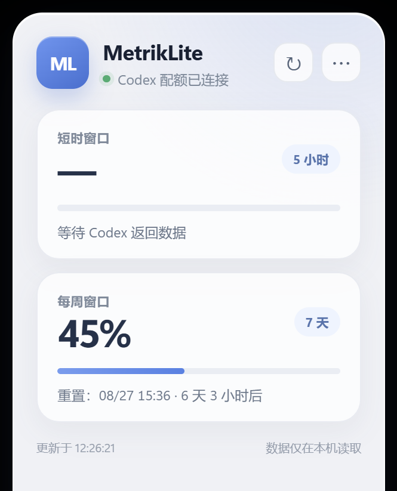

# MetrikLite

<p align="center">
  
</p>

<p align="center">
  轻量、原生、以本地为先的 Windows Codex 配额托盘工具。
</p>

<p align="center">
  <a href="https://github.com/mors-lee/MetrikLite/releases/latest"></a>
  
  
  
  <a href="./LICENSE"></a>
</p>

<p align="center">
  <a href="./README.en.md">English</a> ·
  <a href="https://github.com/mors-lee/MetrikLite/releases/latest">下载最新版</a> ·
  <a href="https://github.com/mors-lee/MetrikLite/issues">反馈问题</a>
</p>



## 为什么使用 MetrikLite

Codex 的配额和重置时间不应打断正在进行的工作。MetrikLite 将当前最紧张的剩余百分比绘制成 Windows 通知区域数字图标，左键即可查看短时与每周窗口。

- 数字托盘图标：`8`、`10`、`100` 都会自动缩放并光学居中。
- 两行信息：剩余百分比与重置时间分开显示。
- 苹果式轻量面板：透明、干净，自动适配多显示器和高 DPI。
- 本地读取：复用一个持久 Codex app-server，不上传账户数据。
- 无 Codex 也可启动：显示 `!` 状态，可从设置选择独立 CLI。
- 开机自启、手动刷新、Codex 路径选择和更新检查。
- Rust + Tauri 2：安装包不再捆绑完整 .NET Desktop Runtime。

## 下载与安装

前往 [Releases](https://github.com/mors-lee/MetrikLite/releases/latest)，选择：

- `MetrikLite_*_x64-setup.exe`：推荐，当前用户安装向导。
- `MetrikLite_*_x64_en-US.msi`：适合 MSI 部署。
- `MetrikLite-portable.exe`：免安装便携版。
- `SHA256SUMS.txt`：所有正式附件的 SHA256。
- `MetrikLite-SBOM.spdx.json`：SPDX 软件物料清单。

安装器面向 Windows 10/11 x64。系统缺少 Microsoft Edge WebView2 Runtime 时，安装器会从微软官方下载引导程序；Windows 11 和大多数 Windows 10 电脑已经预装。

> 当前公开构建尚未配置 Authenticode 商业证书，SmartScreen 可能显示“未知发布者”。请只从本仓库 Releases 下载，并核对 SHA256。签名状态与杀毒检测结果都不能单独证明绝对安全。

## 使用方法

1. 安装并启动 MetrikLite。
2. 托盘数字表示当前未过期窗口中剩余百分比最低的一项。
3. 左键托盘图标显示或隐藏配额面板。
4. 右键可立即刷新、打开设置、检查更新或退出。
5. 设置页可选择独立 `codex.exe`、`codex.cmd` 或 `codex.bat`。

默认每 30 秒刷新，设置范围为 10–300 秒。配置兼容 v1，继续使用：

```text
%APPDATA%\MetrikLite\config.json
%APPDATA%\MetrikLite\metriklite.log
%LOCALAPPDATA%\MetrikLite\Runtime
```

## 没安装 Codex 时会怎样

MetrikLite 不会退出或隐藏所有入口，而是保留 `!` 托盘图标和空状态面板。安装并登录独立 Codex CLI 后点击“立即刷新”即可。

自动查找顺序：

1. `CODEX_BINARY` 环境变量。
2. 设置中保存的路径。
3. 官方 WinGet `OpenAI.Codex_*` 包，优先原生 Windows EXE。
4. `%APPDATA%\npm\codex.cmd`。
5. `PATH` 中的 Codex CLI。

受保护的 `WindowsApps` 内置路径和已知的同名第三方启动器会被跳过。

## 工作原理

```text
Tauri 托盘
   │ 每 10–300 秒或手动刷新
   ▼
Rust Codex 会话管理器
   │ initialize（只执行一次）
   │ account/rateLimits/read（复用同一进程）
   ▼
本机 codex app-server
   │ JSON-RPC stdout
   ▼
配额窗口 → 动态数字图标 + WebView2 面板
```

应用不会在每次刷新后强制终止进程树。CLI 路径不变时复用同一个 app-server；退出时先关闭标准输入并等待正常结束，只有超时才终止直接子进程。

## 隐私与联网范围

### MetrikLite 会读取

- `%APPDATA%\MetrikLite\config.json` 中的本地偏好设置。
- 用户指定或自动找到的 Codex CLI 文件路径。
- Codex app-server 返回的 `rateLimits`、窗口时长和重置时间。
- Windows 字体目录中的 Segoe UI Semibold/Bold，仅用于托盘数字渲染。

### MetrikLite 不会读取

- Codex 对话正文、提示词或回答。
- 项目源码、Git 仓库内容或剪贴板。
- GitHub 密码、验证码、Token。
- 浏览器 Cookie、历史记录或保存的密码。
- Codex 凭据文件内容。登录由 Codex CLI 自己负责。

### MetrikLite 自身请求的域名

- `api.github.com`：仅在用户点击“检查更新”时读取公开 Release 元数据。
- `github.com`：用户主动打开下载页面时由默认浏览器访问。

Codex CLI 为读取账户配额而访问的 OpenAI 服务属于 Codex 自身通信，不经过 MetrikLite 服务器。MetrikLite 没有自己的云服务。

## 从源码构建

### 环境

- Windows 10/11 x64
- Rust stable MSVC
- Visual Studio 2022 Build Tools：Desktop development with C++
- Node.js 22+
- WebView2 Runtime

### 命令

```powershell
npm ci
npm run tauri build
```

开发检查：

```powershell
node --check src\main.js
cargo fmt --manifest-path src-tauri\Cargo.toml --all -- --check
cargo test --manifest-path src-tauri\Cargo.toml --locked
cargo clippy --manifest-path src-tauri\Cargo.toml --locked --all-targets -- -D warnings
```

构建产物位于：

```text
src-tauri\target\release\metriklite.exe
src-tauri\target\release\bundle\nsis\
src-tauri\target\release\bundle\msi\
```

## 自动发布与供应链

推送与 `Cargo.toml`、`tauri.conf.json` 一致的 `v*` 标签后，GitHub Actions 会：

1. 从公开源码构建 Rust/Tauri Release。
2. 生成 NSIS、MSI 和便携 EXE。
3. 生成 SPDX JSON SBOM。
4. 为所有附件生成 `SHA256SUMS.txt`。
5. 自动创建 GitHub Release，不接受本地手工编译后上传。

仓库同时启用 Dependabot、CodeQL、`cargo audit` 和 `npm audit`。安全问题请参阅 [SECURITY.md](SECURITY.md)。

## 项目结构

```text
src/                         无框架 HTML/CSS/JS 面板
src-tauri/src/main.rs        Tauri 生命周期、托盘与前端命令
src-tauri/src/codex.rs       持久 Codex JSON-RPC 会话
src-tauri/src/tray_icon.rs   Segoe UI 数字图标与托盘定位
src-tauri/src/config.rs      配置与当前用户开机自启
src-tauri/tauri.conf.json    Windows 窗口和 NSIS/MSI 打包
.github/workflows/           CI、CodeQL、Release
```

## 许可证与独立实现

MetrikLite 使用 [MIT License](LICENSE)。Rust/Tauri v2 是针对本项目需求的独立实现，没有复制 `keros68/metrik` 的 AGPL 源码。

配额托盘思路受到 [Metrik](https://github.com/keros68/metrik) 启发。如果你同时使用多个 AI coding 工具，或希望体验更多功能，可以查看[雨神的项目](https://github.com/keros68)。

MetrikLite 不是 OpenAI 官方产品，也不代表 OpenAI。
