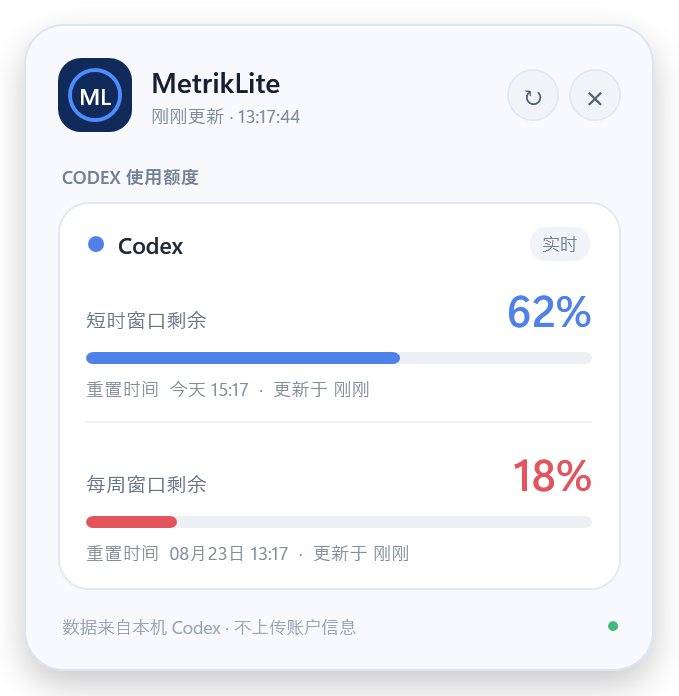
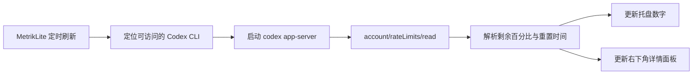
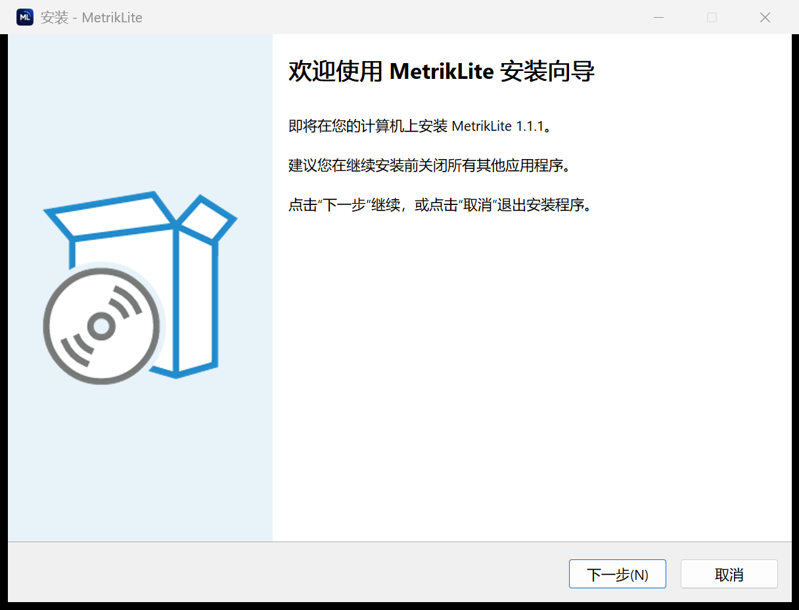

<div align="center">
  

  # MetrikLite

  **让 Codex 剩余额度始终出现在 Windows 托盘。**

  一款轻量、原生、以本地为先的 Windows 托盘工具：用清晰的数字图标显示 Codex 剩余百分比，点击即可查看短时与每周窗口、重置时间和实时状态。

  [](#下载与安装)
  [](#系统要求)
  [](#本地构建)
  [](./LICENSE)

  [简体中文](README.md) | [English](README.en.md)

  <br>
  
</div>

## MetrikLite 是什么？

Codex 的额度藏在应用内部，工作时很难随时确认还剩多少、什么时候重置。MetrikLite 把这件事压缩成一个常驻托盘数字：无需打开网页或切换窗口，扫一眼任务栏即可知道当前最紧张的配额窗口。

| 日常问题 | MetrikLite 的处理方式 |
| --- | --- |
| 不知道 Codex 还剩多少额度 | 托盘图标直接显示剩余百分比数字 |
| 短时窗口和每周窗口容易混淆 | 左键面板分开显示两个窗口、进度条和重置时间 |
| 电脑睡眠后托盘图标消失 | 恢复时自动刷新并重新注册图标 |
| Windows Explorer 重启后图标不见 | 监听任务栏重建消息并恢复托盘状态 |
| Codex CLI 路径不统一 | 自动查找官方 winget、npm 和 PATH，也支持手动选择 |
| 不想安装 .NET 运行时 | 正式安装包内含自包含运行时，安装后即可使用 |
| 不知道是否有新版本 | 右键菜单可直接检查 GitHub Release 更新 |

## 核心功能

### 一眼看到剩余额度

- 每个已启用的 Agent 使用一个独立托盘数字图标。
- 当前版本正式支持 **Codex**，数字表示当前最紧窗口的剩余百分比。
- 数字使用 Segoe UI Variable Display、按实际字形自动缩放并做光学居中。
- 低于或等于 20% 时自动显示为红色，正常状态使用清爽蓝色。

### 右下角原生详情面板

- 左键点击托盘图标后，在当前屏幕任务栏上方弹出圆角卡片。
- 短时窗口与每周窗口分别显示，不把百分比和重置时间挤在同一行。
- 支持高 DPI、多显示器、手动刷新、Esc 关闭与失焦自动隐藏。
- 数据来自本机 Codex app-server，不需要把账户信息交给第三方服务。

### 面向托盘工具的可靠性

- 默认每 30 秒刷新，最低允许设置为 10 秒。
- 电脑从睡眠恢复、任务栏重建或 Explorer 重启后自动恢复。
- 单实例运行，避免重复出现多个托盘图标。
- 找不到 CLI 时仍保留 `!` 状态图标，方便从右键菜单修复路径。
- 错误写入本地日志，偶发读取失败不会直接退出程序。

## 工作流程



MetrikLite 独立实现公开的 Codex app-server JSON-RPC 通信流程：发送 `initialize`、`initialized` 和 `account/rateLimits/read`，读取官方返回的配额窗口。它不会读取聊天内容，也不会上传 Codex 登录凭据。

## 下载与安装

### 推荐：引导安装版

[**下载 MetrikLite 1.1.1 安装程序**](https://github.com/mors-lee/MetrikLite/releases/download/v1.1.1/MetrikLite-Setup.exe)

安装向导支持简体中文和英文，并会引导完成：

1. 查看欢迎说明与 MIT 许可协议。
2. 确认安装位置，默认是 `%LOCALAPPDATA%\Programs\MetrikLite`。
3. 选择是否登录 Windows 后自动启动，默认勾选。
4. 升级时检测正在运行的 MetrikLite，并请求自动关闭旧版。
5. 创建开始菜单和桌面快捷方式，完成后可立即启动。

<div align="center">
  
</div>

安装不需要管理员权限，不会要求 GitHub 密码、验证码或 Token。

### 免安装版

- [单文件 EXE](https://github.com/mors-lee/MetrikLite/releases/download/v1.1.1/MetrikLite.exe)
- [便携版 ZIP](https://github.com/mors-lee/MetrikLite/releases/download/v1.1.1/MetrikLite-portable-win-x64.zip)
- [查看全部版本与发布说明](https://github.com/mors-lee/MetrikLite/releases)

安装包约 67 MB，因为它包含完整的 .NET 8 Windows x64 运行时，目标电脑无需另外安装 .NET。当前安装包尚未进行 Authenticode 商业证书签名，首次运行可能出现 Microsoft Defender SmartScreen 提示；请只从本仓库的 Release 页面下载。

## 系统要求

- 64 位 Windows 10 或 Windows 11。
- 已安装并登录独立的 Codex CLI。
- 普通用户权限即可安装和运行。
- 仅在自行构建源码时需要 [.NET 8 SDK](https://dotnet.microsoft.com/download/dotnet/8.0)。

推荐使用官方 winget 安装 Codex CLI：

```powershell
winget install OpenAI.Codex
codex login
```

## 第一次使用

安装完成后，MetrikLite 会常驻 Windows 任务栏通知区域。

| 操作 | 结果 |
| --- | --- |
| 悬停托盘数字 | 查看剩余百分比与重置时间摘要 |
| 左键单击 | 打开右下角详情面板 |
| 右键单击 | 刷新、检查更新、选择 CLI、设置自启或退出 |
| 面板中的刷新按钮 | 立即重新读取 Codex 配额 |
| Esc 或点击面板外 | 关闭详情面板，但程序继续常驻 |

Windows 可能把新图标放入任务栏的 `^` 隐藏区域。应用无法替用户修改这个系统级排序；如需一直显示，请在 Windows 的“任务栏其他系统托盘图标”设置中开启 MetrikLite。

## Codex CLI 定位规则

MetrikLite 按以下优先级查找可访问的 Codex：

1. 环境变量 `CODEX_BINARY`。
2. 右键菜单中手动选择并保存的 CLI 路径。
3. 官方 winget 包目录。
4. `%APPDATA%\npm\codex.cmd`。
5. PATH 中的 `codex.exe` 或 `codex.cmd`。

PATH 中属于 Trae Solo 的 `ai-agent` 启动器会被自动跳过。Codex 桌面版 `WindowsApps` 目录中的内置 CLI 受到系统权限保护，通常不能由独立桌面程序直接启动；遇到“找不到 Codex binary”时，请安装官方独立 CLI，或在托盘右键菜单中选择一个可访问的 `codex.exe` / `codex.cmd`。

## 配置、日志与隐私

| 内容 | 本地位置 |
| --- | --- |
| 用户配置 | `%APPDATA%\MetrikLite\config.json` |
| 运行日志 | `%APPDATA%\MetrikLite\metriklite.log` |
| 默认安装目录 | `%LOCALAPPDATA%\Programs\MetrikLite` |
| 开机自启 | `HKCU\Software\Microsoft\Windows\CurrentVersion\Run` |

刷新间隔可在 `config.json` 中修改：

```json
{
  "RefreshSeconds": 30
}
```

- 配额读取在本机完成，不经过 MetrikLite 自建服务器。
- 仓库、配置和日志都不需要保存 GitHub Token、Codex 密码或验证码。
- 日志用于记录 CLI 启动、协议状态和错误，不记录聊天正文。

## 常见问题

### 安装后没有看到托盘图标

先打开任务栏的 `^` 隐藏区域。如果看到 `!` 图标，右键选择“设置 Codex CLI 路径”；如果完全没有图标，请检查 `%APPDATA%\MetrikLite\metriklite.log`。

### 睡眠或关机后图标会不会自动恢复？

安装向导默认启用开机自启。睡眠恢复和 Explorer 重启后，程序会重新注册托盘图标；但图标显示在直接可见区还是隐藏区由 Windows 管理。

### 为什么安装包有六十多 MB？

正式版是自包含单文件，内置 .NET 8 桌面运行时，换来目标电脑无需预装任何运行库。若电脑已经安装兼容的 .NET Desktop Runtime，可自行构建 framework-dependent 版本获得更小体积。

### 点击“检查更新”后如何升级？

程序会打开最新 GitHub Release。下载 `MetrikLite-Setup.exe` 后运行，安装器会识别旧版本、提示关闭正在运行的程序并覆盖升级，配置和开机自启状态会保留。

### 托盘数字为什么不显示百分号？

16px 托盘空间非常有限。图标只显示数字以保证清晰度，百分号、窗口名称和重置时间会在悬停提示与详情面板中完整显示。

## 本地构建

```powershell
git clone https://github.com/mors-lee/MetrikLite.git
Set-Location MetrikLite

dotnet build MetrikLite.csproj -c Release --nologo

# 读取协议并输出 8 / 10 / 100 的图标渲染自检
.\bin\Release\net8.0-windows\MetrikLite.exe --smoke smoke-out

# 自包含单文件发布
dotnet publish MetrikLite.csproj -c Release -r win-x64 --self-contained true `
  -p:PublishSingleFile=true `
  -p:IncludeNativeLibrariesForSelfExtract=true `
  -p:EnableCompressionInSingleFile=true `
  -o publish

# 已安装 Inno Setup 6 时构建安装向导
& "$env:LOCALAPPDATA\Programs\Inno Setup 6\ISCC.exe" installer\MetrikLite.iss
```

## 代码结构

```text
App.xaml(.cs)             程序入口、单实例和全局异常处理
TrayHost.cs               刷新调度、Agent 分组、托盘图标与菜单
CodexAppServer.cs         Codex CLI 定位、JSON-RPC 会话与解析
IconRenderer.cs           托盘数字的字体布局、缩放与 Icon 转换
DetailsWindow.xaml(.cs)   右下角配额面板
UpdateChecker.cs          GitHub Release 更新检查
ConfigStore.cs            本地配置读取与保存
Models.cs                 QuotaSnapshot / AgentQuota 数据模型
SmokeTest.cs              协议与图标渲染冒烟测试
installer/                中英双语 Inno Setup 安装脚本
.github/workflows/        CI 与 Release 自动构建
```

## 自动发布

推送 `v*` 标签会触发 GitHub Actions，在干净的 Windows Runner 上完成：

1. Release 模式自包含发布。
2. 构建中英双语 Inno Setup 安装器。
3. 打包便携版 ZIP。
4. 创建 GitHub Release，并上传安装器、单文件 EXE 和 ZIP。

## 项目边界

- 当前正式支持 Codex，代码中的 Agent 抽象用于未来扩展，并不表示其他平台已经可用。
- 每次刷新会启动一次短生命周期的 Codex app-server 子进程，不建议把间隔设置得过短。
- Windows 托盘位置由系统 Shell 管理，应用无法强制把自己固定在直接可见区域。
- 本项目不是 OpenAI 官方产品，也不代表 OpenAI。

## 致谢

- 配额托盘思路受到 [Metrik](https://github.com/keros68/metrik) 启发，如果在用多个AI coding工具，请移步雨神的这个项目。

## License

[MIT](LICENSE) © 2026 Mors
