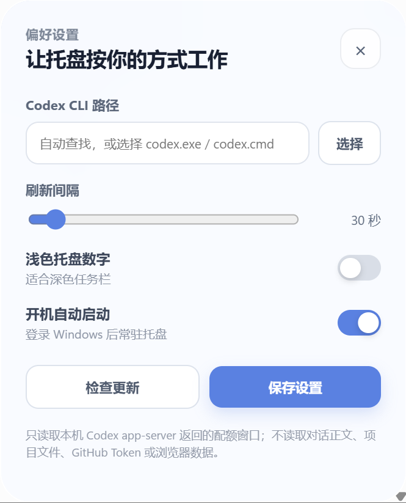
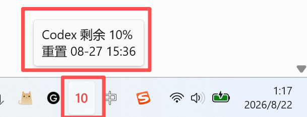
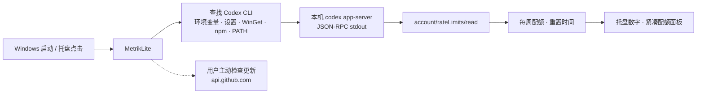

# MetrikLite

<div align="center">
  

  <h1>MetrikLite</h1>

  <strong>把 Codex 每周配额放进 Windows 托盘。</strong><br>
  轻量、原生、本地优先：不用打开 Codex，也能随时看到剩余百分比与重置时间。

  <p>
    <a href="https://github.com/mors-lee/MetrikLite/releases/latest"></a>
    <a href="https://github.com/mors-lee/MetrikLite/actions/workflows/ci.yml"></a>
    <a href="https://github.com/mors-lee/MetrikLite/actions/workflows/codeql.yml"></a>
    
    
    <a href="./LICENSE"></a>
  </p>

  <p>
    <a href="./README.en.md">English</a> ·
    <a href="https://github.com/mors-lee/MetrikLite/releases/latest">下载最新版</a> ·
    <a href="https://github.com/mors-lee/MetrikLite/issues">问题反馈</a> ·
    <a href="./SECURITY.md">安全策略</a>
  </p>

  <br>
  
</div>

## 快速开始：下载并安装

### 推荐：NSIS 安装向导

> **[立即下载 MetrikLite v2.0.2](https://github.com/mors-lee/MetrikLite/releases/download/v2.0.2/MetrikLite_2.0.2_x64-setup.exe)**

也可以前往 [Latest Release](https://github.com/mors-lee/MetrikLite/releases/latest) 获取当前最新版：

| 文件 | 用途 |
| --- | --- |
| `MetrikLite_*_x64-setup.exe` | 推荐，当前用户 NSIS 安装向导 |
| `MetrikLite_*_x64_en-US.msi` | MSI 部署或企业软件分发 |
| `MetrikLite-portable.exe` | 免安装便携版 |
| `SHA256SUMS.txt` | Release 附件的 SHA-256 校验值 |
| `MetrikLite-SBOM.spdx.json` | SPDX JSON 软件物料清单 |

系统要求：Windows 10/11 x64。若系统没有 Microsoft Edge WebView2 Runtime，安装器会使用微软官方引导程序安装；Windows 11 和多数 Windows 10 设备已经预装。

### 安装与首次使用

1. 下载上方的 `MetrikLite_*_x64-setup.exe` 并运行安装向导。
2. 启动 MetrikLite，确认本机已经安装并登录独立 Codex CLI。
3. 查看 Windows 托盘数字；左键点击数字打开配额面板，右键点击打开功能菜单。
4. 如果没有自动识别 Codex，进入“设置”并选择 `codex.exe`、`codex.cmd` 或 `codex.bat`。
5. 保存设置后点击“立即刷新”，即可读取每周配额。

### 关于 Windows 的“未知发布者”提示

当前公开版本尚未配置 Authenticode 商业代码签名证书，因此 SmartScreen 可能提示“未知发布者”。这不等同于检测到病毒，但也不应被忽略：

1. 只从 [MetrikLite 官方 Releases](https://github.com/mors-lee/MetrikLite/releases) 下载。
2. 使用同一 Release 中的 `SHA256SUMS.txt` 核对下载文件。
3. 结合 Windows Defender、VirusTotal、源代码审查和 GitHub Actions 构建记录进行判断。

代码签名、VirusTotal 结果或任何单一信号，都不能单独证明软件绝对安全。

## 界面预览

<table>
  <tr>
    <td width="50%" align="center">
      
      <br><strong>每周配额面板</strong><br>
      显示剩余百分比、进度条和重置倒计时。
    </td>
    <td width="50%" align="center">
      
      <br><strong>偏好设置面板</strong><br>
      选择 CLI 路径、调整刷新间隔和开机自启。
    </td>
  </tr>
  <tr>
    <td colspan="2" align="center">
      
      <br><strong>Windows 托盘显示</strong><br>
      托盘数字显示每周剩余百分比，悬停可查看重置时间。
    </td>
  </tr>
</table>

## MetrikLite 是什么？

查看 Codex 配额通常意味着打开另一个窗口、找到对应页面，再确认下一次重置时间。MetrikLite 常驻 Windows 通知区域，把最需要的一项信息直接变成托盘数字：**当前每周窗口还剩多少百分比**。

| 日常问题 | MetrikLite 的处理方式 |
| --- | --- |
| 想看配额，却要先打开 Codex | 托盘数字持续显示每周剩余百分比，鼠标悬停即可查看重置时间 |
| 每周窗口和短时窗口容易混淆 | v2.0.1 起，托盘与主面板统一使用 Codex 每周窗口 |
| 托盘数字太小、不同位数难辨认 | `0`–`100` 自动缩放并居中，剩余不高于 20% 时显示红色 |
| 不同电脑上的 Codex 路径不一致 | 自动查找 CLI，也可以在设置中指定 `codex.exe`、`codex.cmd` 或 `codex.bat` |
| 面板经常挡住任务栏或跑到错误的屏幕 | 面板按当前鼠标所在显示器的工作区定位，支持多显示器和高 DPI |
| 不想把账号数据交给第三方服务 | 复用本机 Codex app-server；MetrikLite 没有自己的账户、云服务、分析或广告 SDK |

## 一次连接，托盘实时显示



CLI 路径不变时，MetrikLite 会复用同一个 app-server 进程。刷新失败时不会让托盘程序消失，而是保留 `!` 状态和可操作的设置入口。

## 核心能力

### 托盘数字，一眼知道还剩多少

- 显示 Codex 每周窗口的 `0`–`100` 剩余百分比。
- 单位数、两位数和三位数会自动缩放，保持在 32×32 托盘画布中清晰居中。
- 剩余百分比不高于 20% 时使用红色提醒。
- 暂时无法读取配额时显示 `!`，悬停提示会说明当前状态。
- 鼠标悬停显示“Codex 剩余 xx%”与“重置 MM-DD HH:MM”。

### 紧凑面板，查看完整周窗口

- 左键点击托盘数字，显示或隐藏配额面板。
- 面板展示剩余百分比、进度条、绝对重置时间和相对倒计时。
- 右键菜单提供显示配额、立即刷新、设置、检查更新、打开下载页面和退出。
- 面板锚定当前显示器工作区右下角，尽量避开任务栏；空间不足时回退到工作区左上角。
- 支持常规 Windows 缩放、多显示器和高 DPI 环境。

### 连接本机 Codex，而不是另建一套账户系统

- 通过 Codex CLI 的 `app-server` 接口读取配额窗口。
- 使用 JSON-RPC 请求 `account/rateLimits/read` 获取实时数据。
- Codex CLI 路径不变时复用已有会话，减少反复启动进程。
- 退出时先正常关闭标准输入并等待进程结束，超时后才终止直接子进程。
- MetrikLite 不读取 Codex 凭据文件，也不读取对话、提示词、回答或项目内容；登录仍由 Codex CLI 自己负责。

### 自动查找或手动指定 CLI

默认按以下顺序寻找 Codex CLI：

1. `CODEX_BINARY` 环境变量。
2. MetrikLite 设置中保存的路径。
3. 官方 WinGet `OpenAI.Codex_*` 包中的原生 Windows EXE。
4. `%APPDATA%\npm\codex.cmd`。
5. `PATH` 中可用的 Codex CLI。

如果自动识别失败，可以在“设置”中浏览选择 `codex.exe`、`codex.cmd` 或 `codex.bat`。受保护的 `WindowsApps` 内置路径和已知的同名第三方启动器会被跳过，避免误用错误的程序。

### 轻量配置，保持在本机

- 默认每 30 秒刷新一次，可调整为 10–300 秒。
- 可选当前用户开机自启，不需要管理员权限。
- 可切换浅色托盘字形，以适配不同 Windows 主题。
- 配置、日志和 Codex 运行时目录均位于本机用户目录。

## 刷新、配置与本地文件

默认刷新间隔为 30 秒，设置范围为 10–300 秒。配置和日志位于：

```text
%APPDATA%\MetrikLite\config.json
%APPDATA%\MetrikLite\metriklite.log
%LOCALAPPDATA%\MetrikLite\Runtime
```

开机自启只写入当前用户注册表：

```text
HKCU\Software\Microsoft\Windows\CurrentVersion\Run\MetrikLite
```

关闭面板不会退出程序；退出托盘菜单中的“退出”才会关闭 MetrikLite 及其 Codex app-server 会话。

## 隐私与联网范围

### MetrikLite 会读取

- MetrikLite 自己的本地配置和日志目录。
- 用户指定或自动找到的 Codex CLI 文件路径。
- Codex app-server 返回的每周配额百分比、窗口时长和重置时间。
- Windows 字体目录中的 Segoe UI Semibold/Bold，仅用于渲染托盘数字。

### MetrikLite 不会读取

- Codex 对话、提示词、回答或聊天历史。
- 项目源码、Git 仓库内容、文档或剪贴板。
- GitHub 密码、验证码、Token 或 Codex 凭据文件内容。
- 浏览器 Cookie、历史记录或保存的密码。

Codex 登录和它为获取账户配额而进行的 OpenAI 通信由 Codex CLI 自己负责；这些通信不经过 MetrikLite 服务器。MetrikLite 没有自己的云服务、用户账户、分析服务或广告 SDK。

### MetrikLite 自身请求的域名

| 域名 | 何时请求 | 用途 |
| --- | --- | --- |
| `api.github.com` | 用户点击“检查更新” | 获取公开 Release 的版本信息 |
| `github.com` | 用户主动打开下载页面 | 由默认浏览器显示 MetrikLite Release 页面 |

更新检查不是后台遥测；只有用户从菜单或设置中主动触发时才会请求 GitHub 公共 Release 元数据。

## 从源码构建

### 环境要求

- Windows 10/11 x64。
- Rust stable MSVC 工具链。
- Visual Studio 2022 Build Tools，包含 **Desktop development with C++**。
- Node.js 22+。
- WebView2 Runtime。

### 开发运行与生产构建

```powershell
npm ci
npm run tauri dev
npm run tauri build
```

### 本地检查

```powershell
npm audit --audit-level=high
node --check src\main.js
cargo fmt --manifest-path src-tauri\Cargo.toml --all -- --check
cargo test --manifest-path src-tauri\Cargo.toml --locked
cargo clippy --manifest-path src-tauri\Cargo.toml --locked --all-targets -- -D warnings
```

## 自动构建与供应链

正式 Release 由 GitHub Actions 从公开的 `v*` 标签自动构建，并在发布前完成 Windows Authenticode 签名验证：

1. 校验 Git 标签、`tauri.conf.json` 和 `Cargo.toml` 中的版本一致。
2. 从 GitHub Secrets 导入代码签名 PFX，仅在 Release Runner 中使用。
3. 动态生成 `tauri.windows.conf.json`，由 Tauri 调用 Windows SDK `signtool`。
4. 构建并验证 `metriklite.exe`、NSIS、MSI 和便携版 EXE 的 Authenticode 签名。
5. 生成 SPDX JSON SBOM 和 `SHA256SUMS.txt`。
6. 只有全部验证通过后，Draft Release 才会公开发布。

维护者需要在仓库的 Actions Secrets 中配置：

```text
WINDOWS_CERTIFICATE              # Base64 编码的代码签名 .pfx
WINDOWS_CERTIFICATE_PASSWORD     # PFX 导出密码
```

PFX 文件、密码和私钥不得进入 Git。证书配置示例见 [`src-tauri/tauri.windows.conf.example.json`](src-tauri/tauri.windows.conf.example.json)。当前项目只启用 Authenticode；MetrikLite 尚未启用 Tauri 自动更新，因此不配置 `TAURI_SIGNING_PRIVATE_KEY`。

仓库同时启用了 Dependabot、CodeQL、`cargo audit` 和 `npm audit`。漏洞报告方式见 [SECURITY.md](SECURITY.md)。

## 项目结构

```text
src/                         无框架 HTML/CSS/JavaScript 面板
src-tauri/src/main.rs        Tauri 生命周期、托盘菜单与前端命令
src-tauri/src/codex.rs       持久 Codex JSON-RPC 会话与配额读取
src-tauri/src/models.rs      配额状态与每周托盘选择逻辑
src-tauri/src/tray_icon.rs   数字渲染、缩放与面板定位
src-tauri/src/config.rs      配置持久化与当前用户开机自启
src-tauri/tauri.conf.json    窗口、权限及 NSIS/MSI 打包配置
docs/images/                 README 与项目文档使用的截图
.github/workflows/           CI、CodeQL 与 Release 工作流
```

## 许可证与声明

MetrikLite 使用 [MIT License](LICENSE)。托盘配额思路受到 [Metrik](https://github.com/keros68/metrik) 启发；MetrikLite 是独立实现，不是 OpenAI 官方产品，也不代表 OpenAI。

Copyright © 2026 Mors Lee.
